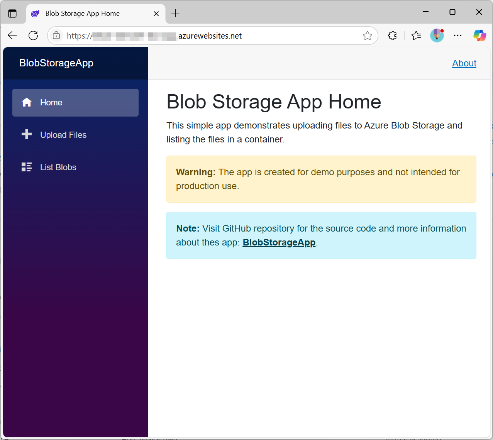
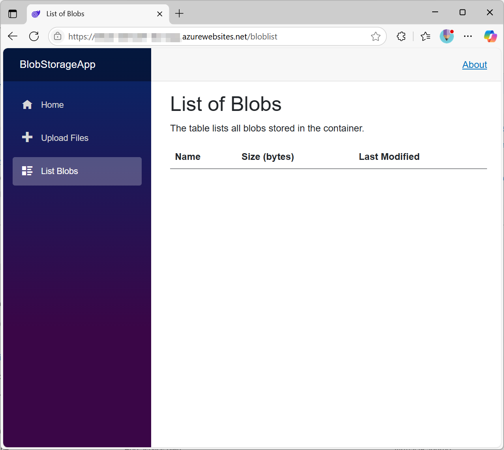

# BlobStorageApp

This simple app demonstrates uploading files to Azure Blob Storage and listing the files in a container.

> Note: The app is intended for demo purposes only and not for production use.

## Screenshots  

### Home



### Upload form


### Container listing



## Configuration

### Environment Variables

To run this app, you need to set the following environment variables in the Azure App Service configuration:

- `AZURE_STORAGE_ACCOUNT_NAME`: The name of the Azure Storage account.
- `AZURE_STORAGE_CONTAINER_NAME`: The name of the blob container where files will be uploaded.
- `ManagedIdentityClientId`: The client ID of the managed identity used to authenticate with Azure

### Permissions

Ensure that the managed identity has the following permissions on the Azure Storage account:

- `Reader` on the Storage Account: This role allows the app to read the storage account properties.
- `Storage Blob Data Contributor` on the Blob Container: This role allows the app to read and upload files to the specified blob container.

## Build and deploy

### Pre-requisites

- [.NET SDK](https://dotnet.microsoft.com/download) (version 9.0 or later)

### Build the app

```pwsh
dotnet build .\BlobStorageApp.sln
dotnet publish -c Release
````

### Deploy the app (PowerShell)

```pwsh
# zip the published files
Compress-Archive -Path .\BlobStorageApp\bin\Release\net9.0\publish\* -DestinationPath .\app.zip -Force
# Connect to Azure
Connect-AzAccount
# deploy to Azure App Service
Publish-AzWebApp -ArchivePath .\app.zip -ResourceGroupName '<ResourceGroupName>' -Name '<AppServiceName>' -Force
````
